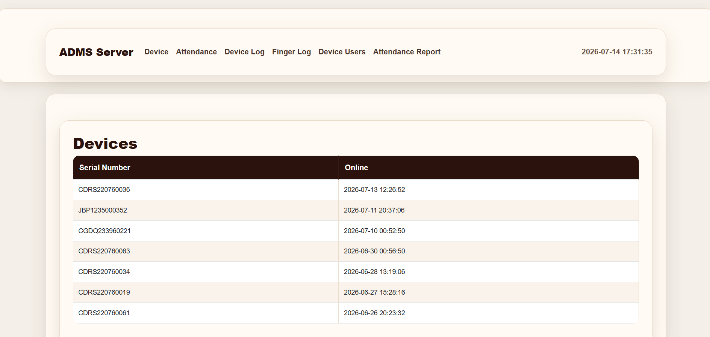
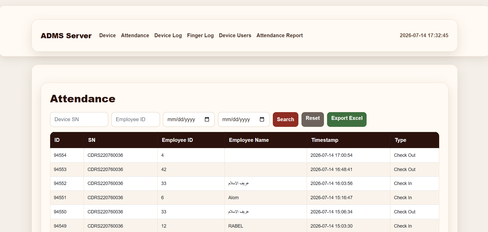
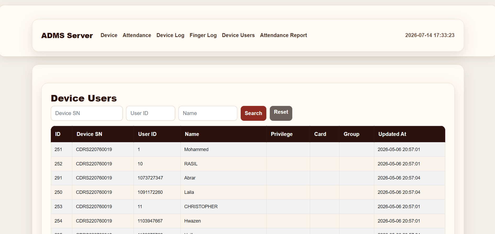
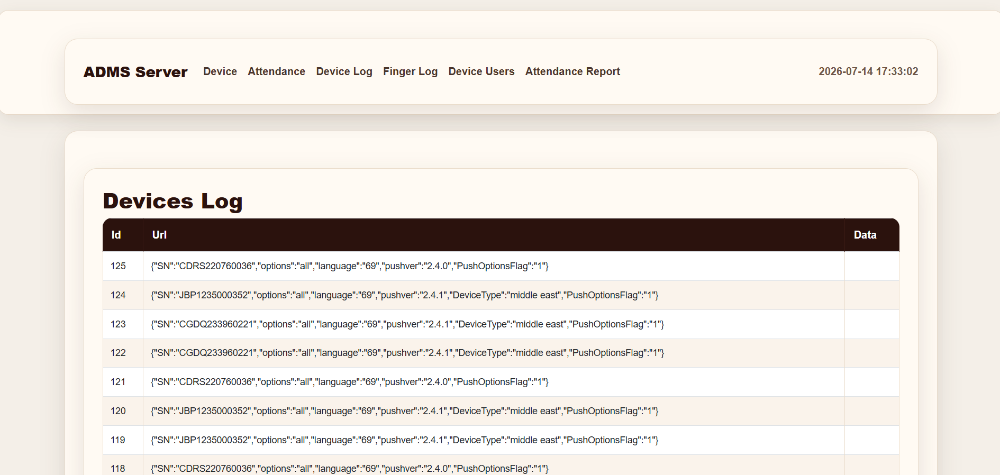

# ZKTeco ADMS Server

A Laravel-based Attendance Device Management System (ADMS) for receiving, managing, and monitoring ZKTeco biometric devices using the iClock (ADMS) protocol.

The system provides centralized attendance collection, employee synchronization, device monitoring, reporting, and administrative tools for organizations operating one or multiple biometric devices.

---

## Features

- Real-time attendance synchronization
- Employee (device user) synchronization
- Device status monitoring
- Attendance log viewer
- Employee name mapping
- Check-In / Check-Out event detection
- Attendance reporting
- Excel export
- Device communication logs
- Fingerprint log viewer
- Search and filtering
- Multi-device support
- Command queue for requesting attendance and user data from devices

---

## Screenshots

### Devices Overview

Displays all connected biometric devices and their latest online status.



---

### Attendance Logs

Browse every attendance event received from devices with employee information, timestamps, and event type.



---

### Device Users

Search and manage employees synchronized from connected biometric devices.



---

### Device Communication Logs

Inspect requests and payloads exchanged between devices and the ADMS server for monitoring and troubleshooting.



---

## Technology Stack

| Component | Technology |
|------------|------------|
| Backend | Laravel 12 |
| Language | PHP 8.x |
| Database | MySQL / MariaDB |
| Frontend | Blade, Bootstrap |
| Excel Export | Laravel Excel |
| Web Server | Nginx |
| Device Protocol | ZKTeco iClock (ADMS) |

---

# Installation

## Requirements

- PHP 8.2+
- Composer
- MySQL or MariaDB
- Nginx (recommended)
- Git

---

## 1. Clone the Repository

```bash
git clone https://github.com/shahzaad4/zkteco-adms-server.git
cd zkteco-adms-server
```

---

## 2. Install Dependencies

```bash
composer install --no-dev --optimize-autoloader
```

---

## 3. Create Environment File

```bash
cp .env.example .env
```

---

## 4. Generate Application Key

```bash
php artisan key:generate
```

---

## 5. Configure Environment

Update the `.env` file with your database settings.

```env
APP_NAME="ADMS Server"
APP_ENV=production
APP_DEBUG=false

DB_CONNECTION=mysql
DB_HOST=127.0.0.1
DB_PORT=3306
DB_DATABASE=adms
DB_USERNAME=your_username
DB_PASSWORD=your_password
```

---

## 6. Run Database Migrations

```bash
php artisan migrate
```

---

## 7. Configure Permissions

```bash
sudo chown -R www-data:www-data storage bootstrap/cache

sudo chmod -R 775 storage bootstrap/cache
```

---

## 8. Optimize Laravel

```bash
php artisan config:cache
php artisan route:cache
php artisan view:cache
```

---

## 9. Configure Nginx

Example server block:

```nginx
server {

    listen 80;

    server_name your-domain.com;

    root /var/www/adms/public;

    index index.php;

    location / {
        try_files $uri $uri/ /index.php?$query_string;
    }

    location ~ \.php$ {
        include snippets/fastcgi-php.conf;
        fastcgi_pass unix:/run/php/php8.2-fpm.sock;
    }

    location ~ /\.ht {
        deny all;
    }
}
```

Reload Nginx:

```bash
sudo nginx -t

sudo systemctl reload nginx
```

---

## 10. Configure ZKTeco Devices

Point every biometric device to:

```
http://YOUR_SERVER_IP/iclock
```

Enable:

- ADMS Mode
- Push Protocol (iClock)
- Correct Server IP
- Correct Port (80 or 443)

---

## Project Structure

```
app/
bootstrap/
config/
database/
public/
resources/
routes/
storage/
```

---

## Future Improvements

- Authentication and user roles
- Department management
- Shift scheduling
- Overtime calculation
- REST API
- Dashboard analytics
- Docker deployment
- Multi-tenant support
- Odoo ERP integration

---
